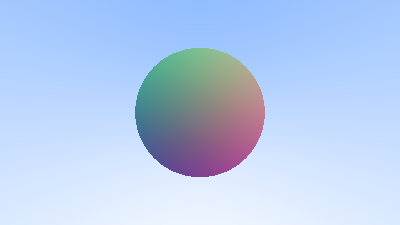
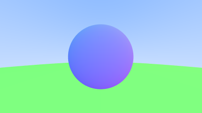
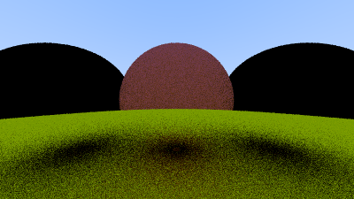

# raytrace-ruby

Ruby raytracer


Written in Ruby 2.7 thanks largely to the book [Ray Tracing in One Weekend](https://raytracing.github.io/books/RayTracingInOneWeekend.html) by Peter Shirley.

Outputs to .ppm format (you'll need something like [GIMP](https://www.gimp.org/) to view the files).

## Screenshots

### Development, In Screenshots

If you want to follow along with trial-and-error for this project, screenshots in the `assets` directory are prefixed with `a` and `b`. 

* `a` screenshots represent development milestones (i.e. I rendered my first circle, I added antialiasing, etc.). 

* `b` screenshots represent setbacks or funny things I ran across while working (i.e. I tweaked a setting and now it's all broken!).

Each screenshot has a number representing a milestone. For instance, for my first render, screenshot `a01` is the development milestone and `b01` was the worst setback I encountered in the session.

The Good | The Bad
:-------:|:------:
 | 
 | 
 | 
 | 
 | 


## Generate Your Own:

Clone this repository, then:

```shell
ruby main.py
```

It'll generate a new timestamped render in the `images` directory.

## Contact

Tyler Porter

tyler.b.porter@gmail.com